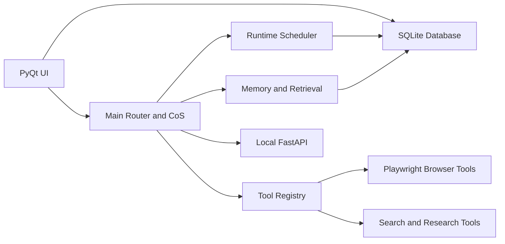

# NaviSsurance Design

Last updated: 2026-05-12

<!-- Pulse private memory visibility + Shield Security/Compliance surface awareness -->

Contributor note:
- If this design doc, older plan files, and the codebase appear to disagree, use `docs/contributor_guide.md` to determine which source should win.

## Architecture Overview
NaviSsurance is a PyQt desktop application with a SQLite-backed data layer, optional background runtime, optional local HTTP API, and a growing shared tool system. The UI remains the primary host, but orchestration, memory, and integrations are no longer confined to the GUI thread.

## Primary Execution Paths

### Desktop host
- `main.py` boots the PyQt application, sets up logging, creates the main window, and optionally starts:
  - the runtime scheduler
  - the local FastAPI service

### Main chat and orchestration
- `core/main_chat_router.py` is the main route selector for non-CoS chat.
- `core/chief_of_staff_service.py` handles CoS planning, delegation, and tool-trigger loops.
- `core/response_handler.py` still hosts several legacy and non-CoS paths.

### Agent and workflow execution
- `core/agent_chat_service.py` handles direct agent conversation behavior.
- `core/agent_execution.py` bootstraps assignment execution into concrete research, drafting, billing, or retrieval work.
- `core/workflow_engine.py` runs the Deep Research and multi-step research pipeline.
- `core/workspace_orchestrator.py` handles Workspace collaboration and drafting flows.

### Runtime and service layer
- `core/runtime/service.py` runs the optional APScheduler-backed background runtime.
- `core/runtime/jobs.py` defines runtime job types such as:
  - assignment bootstrap
  - daily briefing refresh
  - assignment follow-up scan
  - billing autorun
- `api/app.py` exposes a local FastAPI surface for chat, jobs, and tool invocation.
- `core/service/local_api.py` hosts that API from the desktop app when enabled.
- `core/channels/telegram_bot.py` exists as optional dormant scaffolding, but remote chat is not part of the current product direction.

## Shared Tooling
NaviSsurance now has a central tool registry:
- `core/tool_registry.py`

It defines shared tools and metadata such as:
- name
- description
- allowed callers
- side-effect class
- approval requirements

Current shared tool families include:
- internal retrieval
- web research
- browser fetch / workflow / snapshot
- CoS doc search
- CoS memory search
- CoS chat-history search

## Browser Automation
Playwright-backed browser tools live in:
- `core/tools/browser.py`

These support:
- page fetch/render extraction
- multi-step browser workflows
- screenshot capture and evidence artifacts

Legacy Selenium experiments in `core/fda_scraper.py` have been reduced to a wrapper around the shared browser tooling model instead of a standalone import-time script.

## Memory And Retrieval
NaviSsurance uses a layered retrieval architecture:

### Layered durable memory
- `core/user_memory.py`
- `core/agent_memory.py`
- `core/db.py`

The current durable memory layers are:
- `user_memory`
  - global Navi memory for user-wide preferences, facts, aliases, and curated shared recall
- `cos_memory`
  - Chief of Staff planning memory, decisions, tags, and open loops
- `agent_memory`
  - private durable memory for one named specialist agent
- `assignment_memory`
  - task-local memory keyed to assignments and threads, intended for short-horizon working context

Current behaviors include:
- explicit `Teach Navi:` writes to `user_memory`
- explicit `Teach <Agent>:` writes to `agent_memory`
- passive review-first extraction into:
  - `user_memory` from main Navi / CoS paths
  - `agent_memory` from direct agent chat paths
  - `assignment_memory` from assignment/thread work
- promotion flows:
  - `agent_memory -> user_memory`
  - `assignment_memory -> agent_memory`

### Long-term chat retrieval
- `core/chat_retrieval.py`

This provides:
- chunk summaries
- raw-turn grounding
- summary-first retrieval

### Reflection layer
- `core/memory_reflection.py`

This creates higher-level daily and weekly memory summaries.

### Entity-aware memory
The current schema supports entity-linked memory rows so memory can be scoped to:
- user
- client
- project
- assignment / engagement

### Supervisor retrieval model
- direct agents read:
  - their own `agent_memory`
  - relevant `assignment_memory`
  - filtered shared `user_memory`
- Chief of Staff reads:
  - `cos_memory`
  - `user_memory`
  - relevant `agent_memory`
  - relevant `assignment_memory`
- main Navi reads:
  - `user_memory`
  - selective supervisor slices from `agent_memory`
  - selective supervisor slices from `assignment_memory`

The system still uses SQLite as the source of truth. Semantic retrieval is added as an enhancement layer, not a replacement.

## Data Layer
`core/db.py` remains the central persistent store.

Major table families include:
- conversations and chunk summaries
- tasks and projects
- CoS chats, preferences, and plans
- agent threads, assignments, assignment events, and artifacts
- billing clients, time entries, templates, and invoice drafts
- leads and supporting evidence fields
- durable user memory, agent memory, assignment memory, and reflections
- runtime jobs and job runs
- tool call audit
- channel bindings

## Model And Routing Strategy
The current local model path in `config.py` is:
- `Qwen3-14B-Q5_K_M.gguf`

The current routing model is:
- local model for narrow structured or formatting-heavy flows
- Grok for CoS, remote planning, compliance, lead-gen, and shared remote interactions
- OpenAI-hosted `web_search` path for Deep Research when configured

See:
- `docs/llm_routing.md`
- `docs/local_model_validation.md`

## Optional runtime and local API toggles
Runtime scheduler, local API bind address, poll interval, Telegram scaffolding flags, and related non-secret knobs are stored in SQLite (`app_settings`) and edited from **Settings → App preferences**. Legacy `NAVI_*` environment variables may seed those keys once via `core.app_preferences.migrate_legacy_env_preferences()` when a DB value is still unset.

See `docs/runtime_operator.md` for the operator-facing table and verification checklist.

## Current Design Direction
NaviSsurance is evolving toward:
- a desktop-first operating environment for consulting work
- a background-capable runtime for repeatable jobs
- a shared tool system instead of feature-specific one-off tool loops
- richer, entity-aware memory and retrieval
- optional internal service/runtime surfaces that still route back into the same local system of record

<!-- Pulse private memory + Shield triage in design -->