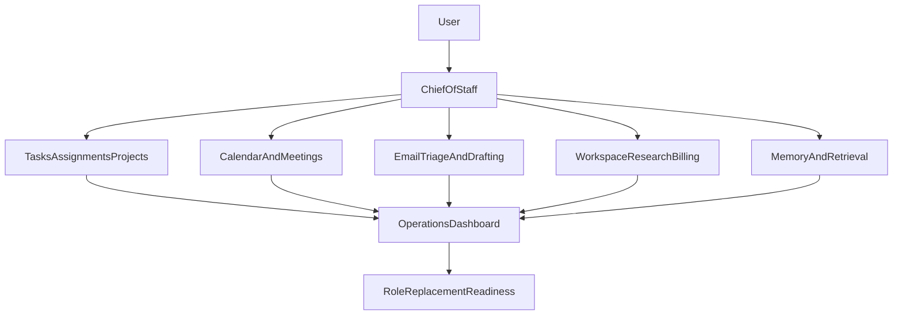

# Staff Replacement Matrix

Last updated: 2026-05-12

<!-- Pulse private memory visibility + Shield Security/Compliance surface awareness -->

## Purpose

This document defines what NaviSsurance would need in order to become a credible replacement for human staff in three specific roles:

- executive assistant,
- project coordinator,
- research/admin support.

It is grounded in the current app architecture and workflows, not a hypothetical future product. The goal is to separate:

- what is already strong,
- what is usable with supervision,
- what is still intentionally manual,
- and what must be built next to reach true replacement readiness.

## Capability Anchors

This assessment is based primarily on the current behavior and product boundaries described in:

- [Chief of Staff service](../core/chief_of_staff_service.py)
- [Database and assignment state](../core/db.py)
- [Daily briefing and email-aware planning](../core/chat_handler.py)
- [Email importance scoring](../core/email_importance.py)
- [Workspace orchestration](../core/workspace_orchestrator.py)
- [Workspace templates](../core/workspace_templates.py)
- [Chief of Staff UI](../gui/chief_of_staff_tab.py)
- [Dashboard UI](../gui/dashboard_tab.py)
- [Project management panel](../gui/project_management_panel.py)
- [Meetings UI](../gui/meetings_tab.py)
- [Chief of Staff product status](./chief_of_staff.md)
- [User workflow guide](./user_manual.md)
- [Current high-level closeout list](../TODO.md)

## Readiness Rubric

Use this rubric when evaluating a role:

- `Ready now`: the app can perform the core work reliably with only spot-checking, and failures are low-risk and easy to reverse.
- `Ready with supervision`: the app can materially reduce human labor, but still needs a person to approve important actions, resolve ambiguity, and recover from edge cases.
- `Not ready yet`: the app has some supporting pieces, but cannot yet be trusted to own the role end to end.

## Current Summary

| Role | Current readiness | Short reason |
| --- | --- | --- |
| Executive assistant | Ready with supervision | Strong planning, task capture, delegation, and schedule awareness, but not full inbox or scheduling ownership. |
| Project coordinator | Ready with supervision | Solid assignment state, project/task surfaces, and document workflows, but weak unified orchestration and verification. |
| Research/admin support | Ready with supervision | Strong drafting, exports, meeting transcription, and research support, but retrieval and closed-loop communications are incomplete. |

If the question is whether the app is already a full staff replacement, the honest answer is: not yet. Today it is best described as a strong single-user operations cockpit with review-first automation.

## Role Matrix

### 1. Executive Assistant

#### Core responsibilities

- daily planning and prioritization,
- task and reminder capture,
- calendar-aware planning,
- scheduling support,
- meeting prep and follow-up,
- inbox triage and response coordination,
- memory of preferences, commitments, and recurring operating norms.

#### Current NaviSsurance coverage

- `Chief of Staff` already handles plan-of-day conversations, AM Sweep, task capture, assignment creation, and calendar-aware planning.
- The app has layered durable memory, pending-memory review, explicit `Teach Navi:` support, and explicit `Teach <Agent>:` support.
- `Dashboard` centralizes briefing, schedule, tasks, and unreplied email context.
- Meetings can produce transcripts and reviewable task drafts.
- The delegation board provides a visible handoff and follow-up loop for specialist agents.

#### What is already good enough

- morning triage and planning,
- converting requests into tasks and assignments,
- surfacing what is overdue, blocked, or needs input,
- collecting context from calendar, tasks, memory, and unreplied email,
- review-first follow-up from meeting transcripts.

#### What still blocks true replacement

- no true inbox ownership or outbound communications loop,
- no robust multi-party scheduling or conflict negotiation engine,
- no universal approve-before-apply pipeline for all side effects,
- long-horizon recall is still weaker than a high-context human assistant,
- no durable background runner that keeps operating and retrying on its own.

#### Required autonomy policy

- tasks and reversible metadata changes can be low-friction,
- calendar changes should remain approval-gated until scheduling logic is much stronger,
- outbound email should remain draft-only until audit, approval, and send controls exist,
- ambiguous requests should keep escalating instead of guessing.

#### Readiness call

`Ready with supervision`

This role is the closest fit today, but only as a high-leverage chief-of-staff tool, not a fully autonomous executive assistant.

### 2. Project Coordinator

#### Core responsibilities

- track open work across projects,
- maintain assignment state and due dates,
- detect blocked work and next actions,
- keep deliverables moving,
- connect work items to project context,
- verify that outputs are actually complete and review-ready,
- keep stakeholders aligned on status.

#### Current NaviSsurance coverage

- `agent_assignments` and related events already support rich state tracking.
- The CoS board surfaces health, due dates, `NEEDS_INPUT`, reassignment, and bulk operations.
- The main task system and `Projects` subtab support deadlines, filtering, and project linkage.
- `Project Management` provides a project-oriented surface with timeline/Gantt support.
- `Workspace` provides document-centered execution for drafting deliverables from source files.

#### What is already good enough

- assignment lifecycle visibility,
- delegation and reassignment,
- due-date updates and task creation from assignments,
- project/task views for one primary operator,
- document drafting workflows that support project deliverables.

#### What still blocks true replacement

- project concepts are fragmented across CoS projects, assignments, and deep-research/workspace flows,
- there is no generalized job runner or unified orchestration backbone,
- dependency management and prioritization are still heuristic,
- verification is weak compared to a real delivery-gate workflow,
- the system remains largely single-user rather than shared-team oriented.

#### Required autonomy policy

- assignment state changes can be semi-automated when deterministic,
- project-wide reprioritization and due-date changes should remain review-first,
- marking major work `done` should eventually require a verification gate,
- cross-project auto-actions need explicit policy and audit logs before they should be trusted.

#### Readiness call

`Ready with supervision`

The app can already do meaningful project-coordination work, but it still needs a person to unify context, judge tradeoffs, and confirm that work is actually complete.

### 3. Research/Admin Support

#### Core responsibilities

- gather and synthesize information,
- draft polished documents,
- export shareable artifacts,
- search prior materials,
- extract follow-up actions from meetings and docs,
- support billing/admin document preparation,
- keep records and outputs organized.

#### Current NaviSsurance coverage

- `Deep Research` handles web-first research pipelines and final briefs.
- `Workspace` supports file-centered drafting with reviewable exports and task extraction.
- Document export already supports `DOCX`, `PDF`, `Markdown`, and `TXT` across multiple workflows.
- `Meetings` supports transcription, save/export, and review-first task extraction.
- `Billing` supports invoice template management, draft generation, and review-first export.
- Email triage exists, and there is lightweight local document retrieval plus offline RAG tooling.

#### What is already good enough

- research brief production,
- reviewable document drafting,
- meeting transcript handling,
- converting transcripts and drafts into candidate tasks,
- invoice-draft generation and document exports.

#### What still blocks true replacement

- unified in-app retrieval across firm knowledge is incomplete,
- email support is still triage-oriented rather than closed-loop communication ownership,
- many workflows depend on external APIs, local configuration, and environment health,
- the app still needs stronger provenance, auditability, and follow-through across long-running admin tasks.

#### Required autonomy policy

- research and document drafting can stay review-first,
- task extraction should continue to require acceptance before import,
- invoices should remain editable drafts until formatting and calculation verification is stronger,
- communication workflows should not auto-send without explicit approval.

#### Readiness call

`Ready with supervision`

This role has broad coverage already, but it is still an advanced assistant rather than a turnkey replacement for a research/admin operator.

## Done Vs Intentionally Manual

This section is the practical closeout boundary for the current product.

### Done or largely implemented

- plan-of-day chat and AM Sweep,
- dashboard-level operational triage,
- durable global memory with review flow,
- task capture and project-linked task management,
- assignment lifecycle tracking with delegation board,
- meeting transcription and review-first task extraction,
- deep research brief generation,
- workspace drafting and export,
- invoice draft generation and template workflows.

### Intentionally manual or not yet replacement-grade

- autonomous outbound email sending,
- autonomous calendar changes without approval,
- multi-party schedule negotiation,
- team-wide multi-user coordination and permissions,
- fully unified project graph across every workflow,
- reliable background execution and retry infrastructure,
- end-to-end verification gates before major work is closed,
- universal search-and-retrieval across all institutional knowledge from one in-app surface.

## What NaviSsurance Is Today

Today NaviSsurance is best described as a local-first consulting operations cockpit:

- part chief of staff,
- part delegation board,
- part drafting workspace,
- part research/admin accelerator.

It already reduces a large amount of staff-like work. It does not yet replace staff in the strongest sense because the final mile still depends on human approval, judgment, ambiguity handling, and operational recovery.

## What Would Qualify As True Staff Replacement

The app would count as a true staff replacement only when it can:

1. remember durable context without constant retraining,
2. act across email, calendar, tasks, meetings, projects, and documents from one unified work graph,
3. apply clear approval rules by action type,
4. retry, recover, and escalate when workflows fail,
5. prove what it did, why it did it, and what remains pending.

## Prioritized Roadmap

### Wave 1: Trust And Memory

- passive memory extraction with approve/edit/reject review,
- alias and terminology memory,
- better long-term retrieval over chats, projects, docs, and assignments,
- clearer audit trails for why actions were proposed or executed.

### Wave 2: Operational Backbone

- unify tasks, assignments, projects, meetings, emails, and artifacts into one work graph,
- add a durable job queue with retries, status, and recovery,
- add an explicit approval-policy engine by action type,
- add escalation and stuck-work handling.

### Wave 3: Closed-Loop Execution

- inbox ownership workflows,
- stronger scheduling and calendar negotiation,
- automated follow-ups and blocked-work recovery,
- verification gates before important work is marked complete.

### Wave 4: Replacement Readiness

- one operations dashboard for pending approvals, failures, blocked work, and high-priority actions,
- restart/session persistence validation,
- live integration hardening across email, calendar, transcription, and export flows,
- explicit scorecard reviews for whether each target role has reached replacement-grade trust.

## Practical Build Order

If only a few things can be built next, prioritize them in this order:

1. passive memory plus long-horizon retrieval,
2. unified work graph plus job queue,
3. approval-policy engine and audit log,
4. inbox and scheduling automation,
5. verification and replacement-readiness dashboards.

<!-- Pulse private memory + Shield triage in staff matrix -->

## Architecture View

